# Модель данных Mini Bank

Учебная главная книга (GL). Источник истины — журнал проводок; остатки
вычисляются из него. Диаграмма — в Mermaid (рендерится прямо на GitHub).

## ER-диаграмма

```mermaid
erDiagram
    chart_of_accounts ||--o{ personal_accounts : "coa_number"
    customers ||--o{ personal_accounts : "customer_id"
    products ||--o{ personal_accounts : "product_code"
    operating_days ||--o{ documents : "operating_day"
    operating_days ||--o{ close_of_day_runs : "operating_day"
    documents ||--|| journal_entries : "document_id"
    journal_entries ||--o{ entry_lines : "entry_id"
    personal_accounts ||--o{ entry_lines : "account_id"

    chart_of_accounts {
        text account_number PK
        text account_name
        text account_type "asset|liability|equity|income|expense|off_balance"
        char currency "RUB|USD"
        text normal_side "debit|credit (генерируется)"
    }
    customers {
        bigint customer_id PK
        text customer_code UK "синтетика, не PII"
        text full_name "синтетика"
        text customer_type "individual|corporate"
    }
    products {
        text product_code PK "current|deposit|loan|nostro"
        numeric interest_rate "годовая ставка, %"
    }
    personal_accounts {
        bigint account_id PK
        text account_number UK "40817.810.00000000001"
        text coa_number FK
        bigint customer_id FK "NULL = счёт банка"
        char currency
        date opened_on
    }
    fx_rates {
        date rate_date PK
        char currency PK
        numeric rate_to_rub
    }
    operating_days {
        date operating_day PK
        text status "open|closed"
        timestamptz closed_at
    }
    documents {
        bigint document_id PK
        date operating_day FK
        text doc_type
        text description "человекочитаемое назначение"
    }
    journal_entries {
        bigint entry_id PK
        bigint document_id FK UK
        date entry_date "= operating_day документа"
        text status "posted|reversed"
    }
    entry_lines {
        bigint entry_line_id PK
        bigint entry_id FK
        bigint account_id FK
        numeric debit_amount "XOR с credit_amount"
        numeric credit_amount
        numeric amount_currency "валютная сумма для счетов в валюте"
    }
    close_of_day_runs {
        bigint run_id PK
        date operating_day FK
        text status "running|success|failed"
        jsonb details "результаты контролей"
    }
```

## Поток данных: от события до отчёта

```mermaid
flowchart LR
    A[Событие: клиент внёс наличные] --> B[documents<br/>мемориальный ордер]
    B --> C[journal_entries + entry_lines<br/>проводка, Дт=Кт]
    C --> D[trial_balance&#40;date&#41;<br/>функция: пробный баланс]
    C --> E[v_balances_daily<br/>витрина дневных движений]
    D --> F[ОСВ / баланс / ОПУ<br/>модули 08–10]
```



## Инварианты (гарантирует PostgreSQL, не Python)

1. **Двойная запись.** Констрейнт-триггер `check_entry_balance` на
   `entry_lines` (DEFERRABLE INITIALLY DEFERRED) на COMMIT проверяет:
   сумма дебетов = сумме кредитов в каждой проводке.
2. **Закрытый день.** Триггер `check_operating_day_open` на `documents`
   запрещает проведение в день со статусом `closed`.
3. **Консистентность даты.** Триггер `check_entry_date_matches_document`
   требует `entry_date = documents.operating_day`.
4. **Одна сторона строки.** CHECK на `entry_lines`: заполнен ровно один из
   `debit_amount` / `credit_amount`, сумма > 0.
5. **Остаток не хранится.** Нет колонки `balance`: сальдо — это
   `SUM(debit) − SUM(credit)` по журналу. Витрины (`trial_balance()`,
   `v_balances_daily`) — производные, пересчитываемые в любой момент.

## Ключевые решения

- `entry_lines.amount` (debit/credit) — **всегда в RUB** (функциональная
  валюта). Для валютных счетов валютная сумма — в `amount_currency`, а
  рублёвый эквивалент по курсу дня — в debit/credit. Так вся отчётность
  складывается в одной валюте без пересчётов на лету.
- Счета самого банка (касса, ностро, капитал, доходы/расходы) — лицевые
  счета с `customer_id IS NULL`.
- `balances_daily` намеренно реализована как **представление**, а не
  физтаблица: материализация витрин — тема модуля 08.
